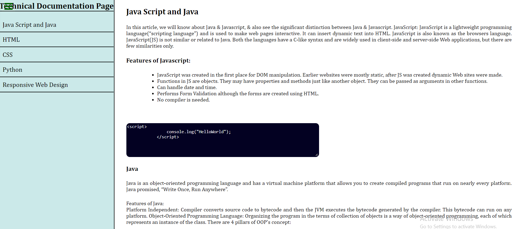

# Build a Technical Documentation Page

This is a solution to the [Build a Technical Documentation Page](https://techical-documentation-page.netlify.app/).
FreeCodeCamp projects help you improve your coding skills by building realistic projects.

## Table of contents

- [Overview](#overview)
  - [Screenshot](#screenshot)
  - [Links](#links)
- [My process](#my-process)
  - [Built with](#built-with)
  - [What I learned](#what-i-learned)
  - [Continued development](#continued-development)
- [Author](#author)

## Overview

This project should have:

- On regular sized devices (laptops, desktops), the element with id="navbar" should be shown on the left half of the screen. 
- Media query
- Main element
- The first element within each .main-section should be a <header> element which contains text that describes the topic of that section.
- <p>,<li>,<code> elements

### Screenshot



### Links

- Solution URL: [https://github.com/Holllyyyy/techicaldicumentationpage](https://github.com/Holllyyyy/techicaldicumentationpage)
- Live Site URL: [https://techical-documentation-page.netlify.app/](https://techical-documentation-page.netlify.app/)

## My process

I started with writing HTML where I added nav bar with links to sections. Than I made few sections,with a lot of text, with <p> element,<li>,<code>. When I wrote code in html  I put like this:

```html
 <h3>An example of an attribute is:</h3>
                   <pre> <code class="cod"><textarea disabled>  </textarea></code></pre>
<!---This is how I put code to be represent on the page---->

```

After it I moved on my style. I make css folder, and wrote CSS3.
Some new stuff I've done:

```css
.container{
    display: grid;
    grid-column-gap: 20px;
    grid-template-columns: minmax(250px,auto)1fr;/*left side 250px n right side taking all space n 1 fr is how big it is*/
grid-template-areas: 
'nav m'
;
}/*here making grid with template areaas how I wanna my page to look like, grid gap is just space between them. Ive done this projects as a main of practicing CSS Grid, but there is still some issues I have to fix, formobile devices*/

```

### Built with

- Semantic HTML5 markup
- CSS custom properties
- CSS Grid

### What I learned

While working on this project I learned :
- how to make nav bar and content of webpage using CSS Grid
- how to set nav bar to be on top left of the viewport
- to connect nav bar with all section when its being clicked
- how to write some code inside paragraph, or any text.


### Continued development

I will continue next with a Personal Portfolio Webpage, from freeCodeCamp. I want to practice and improve my HTML5 and CSS3 skills.

## Author

- Website - [Svetlana Jokic](https://my-portfolio-hollyy.netlify.app/)
- Frontend Mentor - [@Holllyyyy](https://www.frontendmentor.io/profile/Holllyyyy)
- Twitter - [@svetlanajokic](https://twitter.com/svetlanajokic)
- LinkedIn - [@Svetlana Jokic](https://www.linkedin.com/in/svetlana-jokic-787432100/)
- FreeCodeCamp - [@hollyy](https://www.freecodecamp.org/hollyy)
